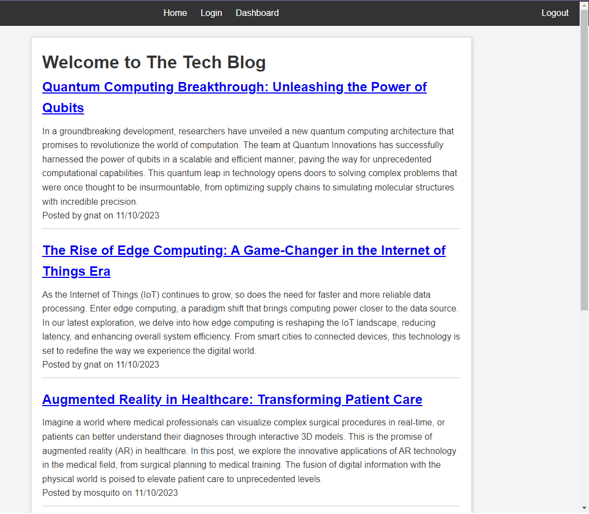

# MVC Challenge: Tech Blog

## Description
This Tech Blog is a CMS-style platform, inspired by the ubiquitous role of writing in the tech industry. It's built from scratch and follows the MVC paradigm, integrating technologies like Handlebars.js, Sequelize, and various npm packages. This project was not just an assignment; it was a journey to understand the intricacies of modern web development and provide a useful tool for developers to share their insights.

## User Story
👩‍💻 As a developer who writes about tech,
- I want a CMS-style blog site so that I can publish articles, blog posts, and my thoughts and opinions.

## Table of Contents
- [Installation](#installation)
- [Usage](#usage)
- [Credits](#credits)
- [License](#license)

## Installation
🛠️ Steps to install:
1. Clone the repository: 'git clone https://github.com/grayd500/techblog-challenge2'
2. Install dependencies: 'npm install'
3. Configure environment variables in a '.env' file.
4. Initialize the database: '[specific commands]'
5. Start the server: 'npm start'

## Usage
🌐 To use the Tech Blog:
- Navigate to '[URL]' or run locally.
- Sign up or log in.
- Explore, write, and interact with blog posts.

## Preview

## Links
🐱 GitHub Repository: https://github.com/grayd500/techblog-challenge2

⚛️ Heroku Deployment: https://hidden-spire-39369-ddfbfb383def.herokuapp.com/

## Credits
🤝 Credits:
- ChatGPT for README.md assistance, code snippets, commenting, Heroku deployment, and creating dummy data.
- Katie Redford (EdX TA) and Coding Bootcamp TAs for setup guidance and troubleshooting.

## License
This project is licensed under the MIT License.

## Features
🌟 Features include:
- User authentication.
- Blog posting, editing and commenting.

## How to Contribute
👩‍💻 To contribute:
- Fork the repository.
- Make your changes.
- Submit a pull request.

## Tests
🧪 To run tests:
- Use the command: 'npm test'

